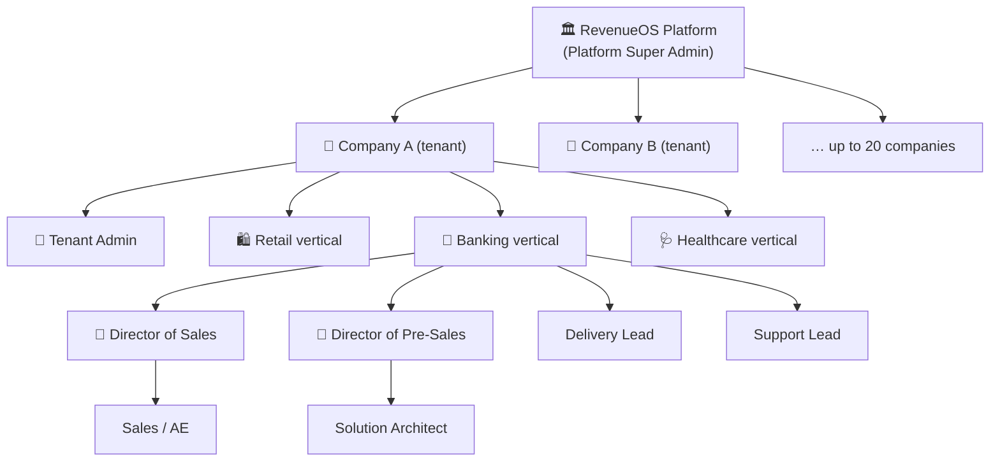
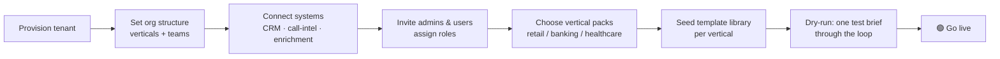
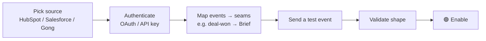
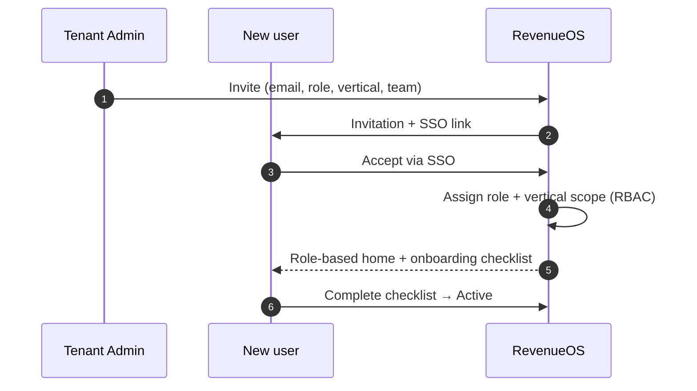
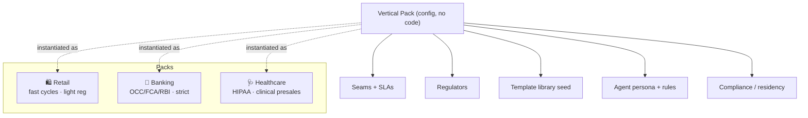
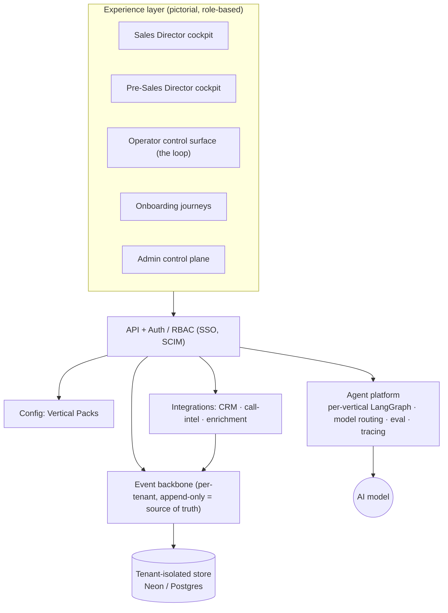
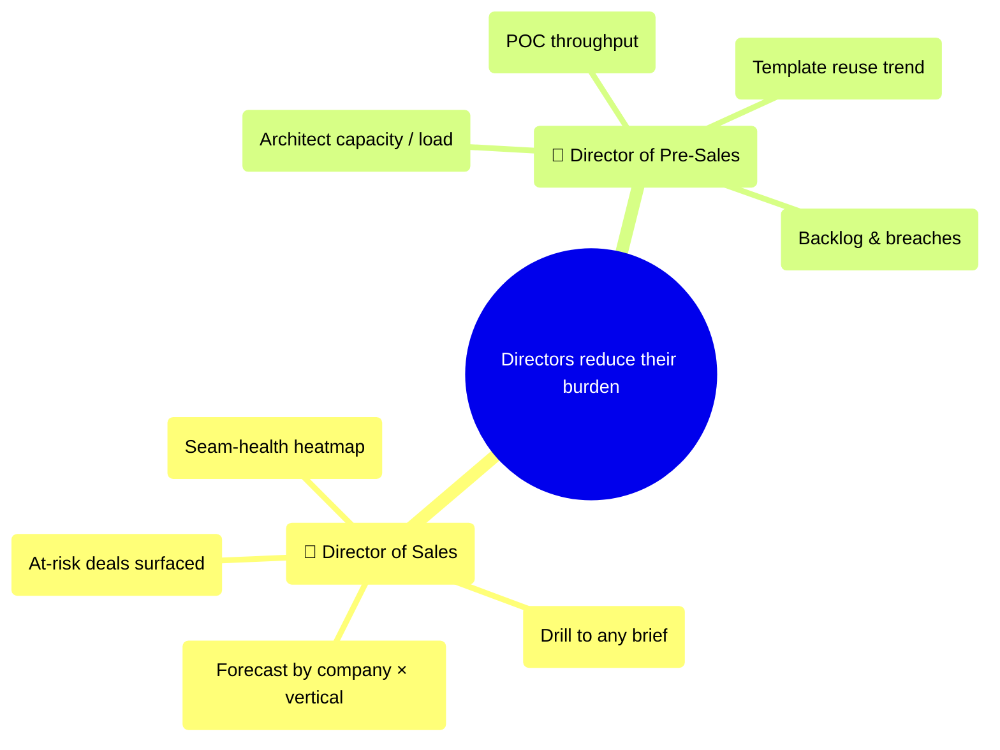

# RevenueOS — Enterprise Product Plan (pictorial)

How RevenueOS works as a **multi-tenant platform** a trillion-dollar company would
buy: many companies, many verticals, tens of thousands of users, onboarded team
by team — retail today, banking tomorrow, healthcare the day after.

> Planned as GitHub issues: [**milestones M0–M6**](https://github.com/anupsahoo/revenueos/milestones)
> · [**epics**](https://github.com/anupsahoo/revenueos/issues?q=is%3Aissue+is%3Aopen+label%3Aepic)

---

## ⚠️ What exists today, and what this document is

**Everything below this line is a plan, not a product.** Read it as the shape I
would build toward, not as a description of running software.

| | |
|---|---|
| **Shipped (M0)** | One screen: the Sales → PreSales operator loop, on an append-only event log, single tenant, synthetic data. 18 issues closed. That is all of it. |
| **Planned (M1–M6)** | Everything on this page — multi-tenancy, onboarding journeys, vertical packs, the director cockpits, the agent platform. 45 open issues. No code. |

There is no auth, no second tenant, no cockpit and no vertical pack in the repo
today. The diagrams here are how the shipped loop would generalise, drawn so the
sequencing and the dependencies are arguable before anyone writes the code.
What is actually built is in [`docs/STATUS.md`](docs/STATUS.md); what I chose not
to build is in [`docs/CUT-LIST.md`](docs/CUT-LIST.md).

---

## 1. Who uses it — tenancy & personas

> Built by [EPIC #20 · Multi-tenancy & identity](https://github.com/anupsahoo/revenueos/issues/20) — tickets [#30](https://github.com/anupsahoo/revenueos/issues/30) tenant model, [#31](https://github.com/anupsahoo/revenueos/issues/31) RBAC matrix, [#32](https://github.com/anupsahoo/revenueos/issues/32) SSO/SCIM, [#33](https://github.com/anupsahoo/revenueos/issues/33) isolation guards.

Each vertical is its **own world** — retail sales ≠ banking sales ≠ healthcare
sales, and pre-sales differs the same way. A user belongs to a company, a
vertical, and a role.

### User types (RBAC)

| Persona | Scope | What they do | Rough count @ scale |
|---|---|---|---|
| Platform Super Admin | Platform | Operates RevenueOS, onboards companies | tens |
| Tenant Admin | Company | Onboards verticals, systems, users | ~1–3 / company |
| **Director of Sales** | Company / verticals | Forecast, seam-health across the portfolio | ~1 / company |
| **Director of Pre-Sales** | Company / verticals | Capacity, POC throughput, reuse | ~1 / company |
| Sales Manager / AE | Vertical | Owns opportunities, hands off briefs | thousands |
| Solution Architect | Vertical | Turns briefs into POC plans (the loop) | thousands |
| Delivery Lead | Vertical | Receives the handoff | hundreds |
| Support Lead | Vertical | Feeds renewal/upsell signals back | hundreds |
| Viewer / Exec stakeholder | Company | Read-only dashboards | many |

**Scale target:** 20 companies · 40 projects · 20k–40k users · isolated per tenant.

---

## 2. How a company is onboarded (the journey)

> Built by [EPIC #21 · Onboarding suite](https://github.com/anupsahoo/revenueos/issues/21) — [#34](https://github.com/anupsahoo/revenueos/issues/34) is this wizard, [#38](https://github.com/anupsahoo/revenueos/issues/38) the status tracker.

Owner + status is tracked at every step (a pictorial progress map, not a form).

## 3. How a system is onboarded

> Built by [EPIC #27 · Data & integrations](https://github.com/anupsahoo/revenueos/issues/27) — [#56](https://github.com/anupsahoo/revenueos/issues/56) connector framework, [#57](https://github.com/anupsahoo/revenueos/issues/57) the first real CRM webhook, [#58](https://github.com/anupsahoo/revenueos/issues/58) call intelligence.

## 4. How a user is onboarded (RBAC)

> Built by [#36](https://github.com/anupsahoo/revenueos/issues/36) invite and role assignment, on [#32](https://github.com/anupsahoo/revenueos/issues/32) SSO/SCIM and [#31](https://github.com/anupsahoo/revenueos/issues/31) the permissions matrix.

---

## 5. Verticals are configurable "packs"

> Built by [EPIC #22 · Vertical packs](https://github.com/anupsahoo/revenueos/issues/22) — [#39](https://github.com/anupsahoo/revenueos/issues/39) is the schema, [#40](https://github.com/anupsahoo/revenueos/issues/40)/[#41](https://github.com/anupsahoo/revenueos/issues/41)/[#42](https://github.com/anupsahoo/revenueos/issues/42) the three packs, [#43](https://github.com/anupsahoo/revenueos/issues/43) the authoring screen.

Switching a team's vertical changes its seams, SLAs, templates and **agent
behaviour** — no code change. That is how retail today / banking tomorrow works.

---

## 6. Platform architecture (multi-tenant)

> Built by [EPIC #26 · Scale & event store](https://github.com/anupsahoo/revenueos/issues/26) and [EPIC #25 · Agent platform](https://github.com/anupsahoo/revenueos/issues/25). [#53](https://github.com/anupsahoo/revenueos/issues/53), the durable per-tenant store, is the first ticket after M0 — see `docs/ROADMAP.md`.

Everything is **tenant-scoped**; health, reuse and rankings are **computed from
the per-tenant event log**, never typed in.

---

## 7. The two director cockpits (why they buy it)

> Built by [EPIC #23 · Executive cockpits](https://github.com/anupsahoo/revenueos/issues/23) — [#44](https://github.com/anupsahoo/revenueos/issues/44) sales, [#45](https://github.com/anupsahoo/revenueos/issues/45) pre-sales, [#46](https://github.com/anupsahoo/revenueos/issues/46) the shared drilldown.

Each director answers one question at a glance — Sales: *where is the risk?*
Pre-Sales: *where is the burden?* — then drills portfolio → company → vertical →
brief. The operator loop (today's prototype) is one role's view inside this.

---

## Build order (milestones)

Every ticket below has acceptance criteria, the files it would touch, what it
depends on and a size. None of them is a placeholder, and none of them is built.

| Milestone | What it delivers | Epics | Open | Status |
|---|---|---|---|---|
| **M0 · Prototype** | The Sales → PreSales loop on an event log | — | 1 | **shipped**, 18 closed |
| **M1 · Multi-tenant foundation** | Tenancy, RBAC, SSO, isolation | [#20](https://github.com/anupsahoo/revenueos/issues/20) | 5 | planned |
| **M2 · Onboarding suite** | Company, vertical, user, project journeys + real sources | [#21](https://github.com/anupsahoo/revenueos/issues/21), [#27](https://github.com/anupsahoo/revenueos/issues/27) | 10 | planned |
| **M3 · Vertical packs** | Retail, banking, healthcare as configuration | [#22](https://github.com/anupsahoo/revenueos/issues/22) | 6 | planned |
| **M4 · Executive cockpits** | Two director cockpits + operator v2 | [#23](https://github.com/anupsahoo/revenueos/issues/23), [#24](https://github.com/anupsahoo/revenueos/issues/24) | 7 | planned |
| **M5 · Agent platform & scale** | Per-vertical agents, eval, durable store, workers | [#25](https://github.com/anupsahoo/revenueos/issues/25), [#26](https://github.com/anupsahoo/revenueos/issues/26) | 9 | planned |
| **M6 · Design system & governance** | Component library, audit, residency, posture | [#28](https://github.com/anupsahoo/revenueos/issues/28), [#29](https://github.com/anupsahoo/revenueos/issues/29) | 8 | planned |

**46 open, 18 closed.** The one open M0 ticket is
[#13](https://github.com/anupsahoo/revenueos/issues/13), reopened because only a skeleton exists and closed should mean
done.

The milestone order is not the build order. [#53](https://github.com/anupsahoo/revenueos/issues/53) — the durable event
store — sits in M5 and is the first thing I would build after M0, because
everything on screen derives from the log and the log surviving a restart is the
difference between a demo and a product. That argument, the twelve-week sequence
and the four-week cut are in [`docs/ROADMAP.md`](docs/ROADMAP.md).
