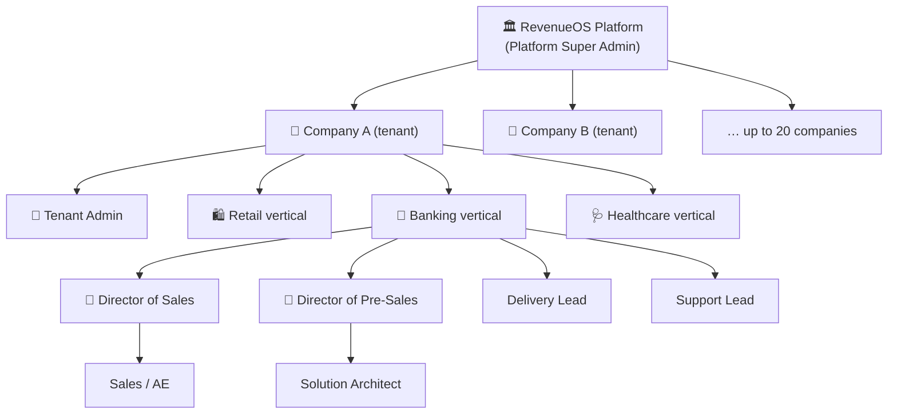
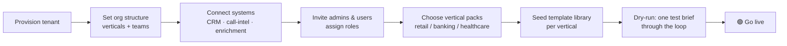
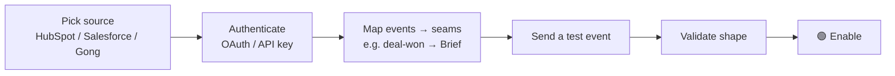
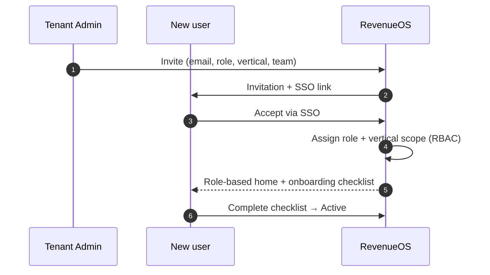
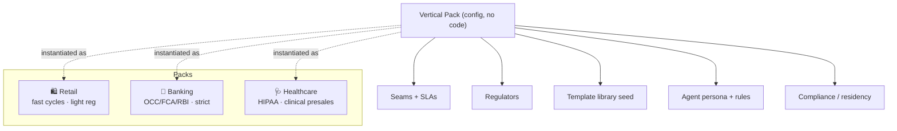
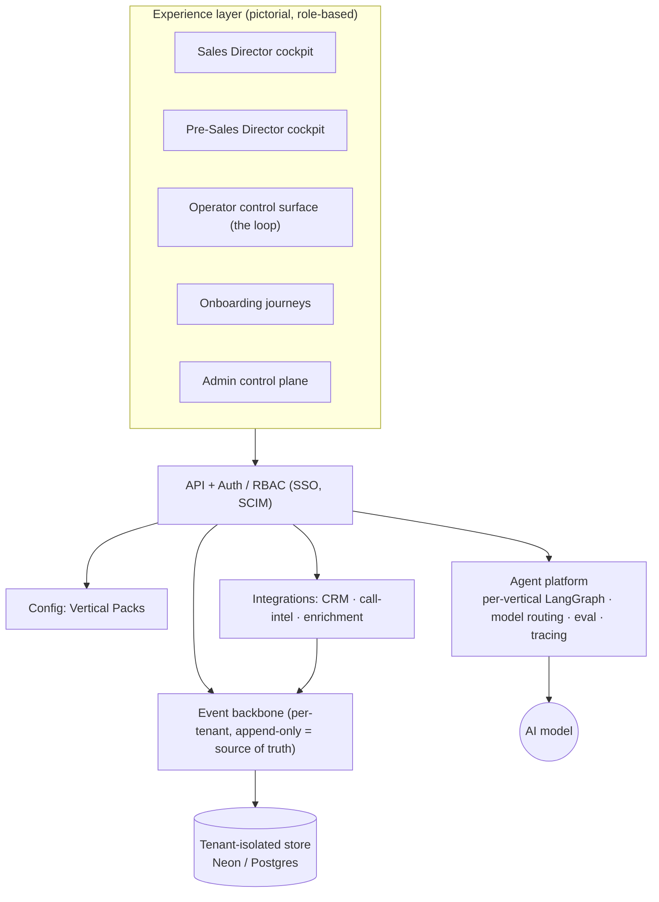
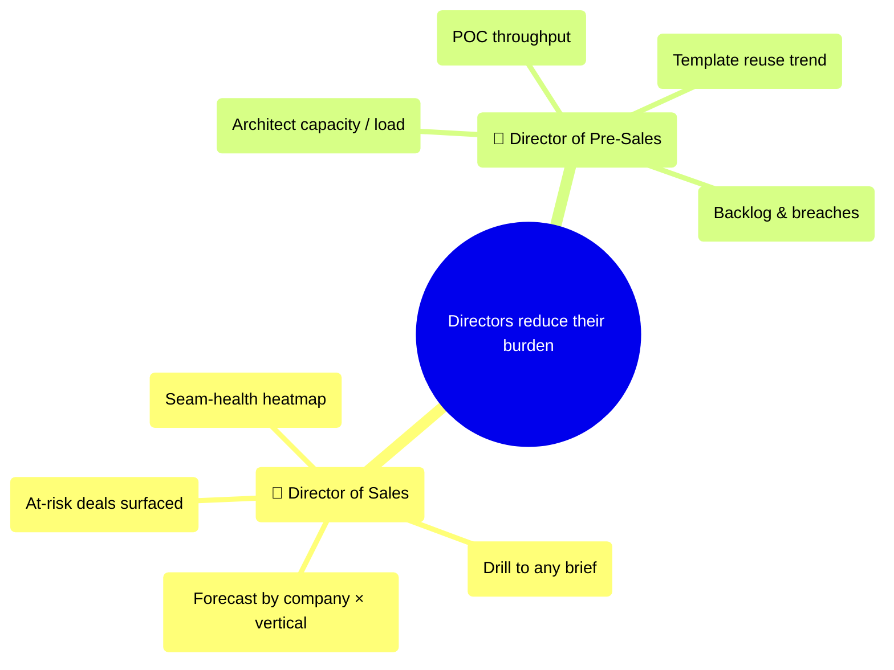

# RevenueOS — Enterprise Product Plan (pictorial)

How RevenueOS works as a **multi-tenant platform** a trillion-dollar company would
buy: many companies, many verticals, tens of thousands of users, onboarded team
by team — retail today, banking tomorrow, healthcare the day after.

> Planned as GitHub issues: [**milestones M0–M6**](https://github.com/anupsahoo/revenueos/milestones)
> · [**epics**](https://github.com/anupsahoo/revenueos/issues?q=is%3Aissue+is%3Aopen+label%3Aepic)

---

## ⚠️ What exists today, and what this document is

**Everything below this line is a plan, not a product.** Read it as the shape I
would build toward, not as a description of running software.

| | |
|---|---|
| **Shipped (M0, v0.2.0)** | One screen: the Sales → PreSales operator loop, on an append-only event log, single tenant, synthetic data. 18 issues closed. That is all of it. |
| **Planned (M1–M6)** | Everything on this page — multi-tenancy, onboarding journeys, vertical packs, the director cockpits, the agent platform. 45 open issues. No code. |

There is no auth, no second tenant, no cockpit and no vertical pack in the repo
today. The diagrams here are how the shipped loop would generalise, drawn so the
sequencing and the dependencies are arguable before anyone writes the code.
What is actually built is in [`docs/STATUS.md`](docs/STATUS.md); what I chose not
to build is in [`docs/CUT-LIST.md`](docs/CUT-LIST.md).

---

## 1. Who uses it — tenancy & personas

Each vertical is its **own world** — retail sales ≠ banking sales ≠ healthcare
sales, and pre-sales differs the same way. A user belongs to a company, a
vertical, and a role.

### User types (RBAC)

| Persona | Scope | What they do | Rough count @ scale |
|---|---|---|---|
| Platform Super Admin | Platform | Operates RevenueOS, onboards companies | tens |
| Tenant Admin | Company | Onboards verticals, systems, users | ~1–3 / company |
| **Director of Sales** | Company / verticals | Forecast, seam-health across the portfolio | ~1 / company |
| **Director of Pre-Sales** | Company / verticals | Capacity, POC throughput, reuse | ~1 / company |
| Sales Manager / AE | Vertical | Owns opportunities, hands off briefs | thousands |
| Solution Architect | Vertical | Turns briefs into POC plans (the loop) | thousands |
| Delivery Lead | Vertical | Receives the handoff | hundreds |
| Support Lead | Vertical | Feeds renewal/upsell signals back | hundreds |
| Viewer / Exec stakeholder | Company | Read-only dashboards | many |

**Scale target:** 20 companies · 40 projects · 20k–40k users · isolated per tenant.

---

## 2. How a company is onboarded (the journey)

Owner + status is tracked at every step (a pictorial progress map, not a form).

## 3. How a system is onboarded

## 4. How a user is onboarded (RBAC)

---

## 5. Verticals are configurable "packs"

Switching a team's vertical changes its seams, SLAs, templates and **agent
behaviour** — no code change. That is how retail today / banking tomorrow works.

---

## 6. Platform architecture (multi-tenant)

Everything is **tenant-scoped**; health, reuse and rankings are **computed from
the per-tenant event log**, never typed in.

---

## 7. The two director cockpits (why they buy it)

Each director answers one question at a glance — Sales: *where is the risk?*
Pre-Sales: *where is the burden?* — then drills portfolio → company → vertical →
brief. The operator loop (today's prototype) is one role's view inside this.

---

## Build order (milestones)

`M0` shipped prototype → `M1` multi-tenant foundation → `M2` onboarding suite →
`M3` vertical packs → `M4` cockpits + operator v2 → `M5` agent platform & scale →
`M6` pictorial design system & governance. Details in the
[epics](https://github.com/anupsahoo/revenueos/issues?q=is%3Aissue+label%3Aepic).
