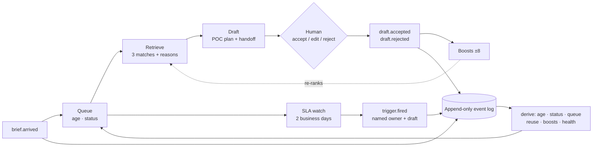
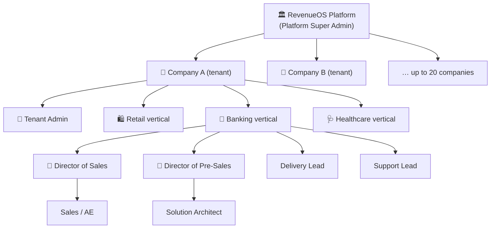
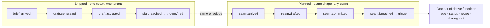
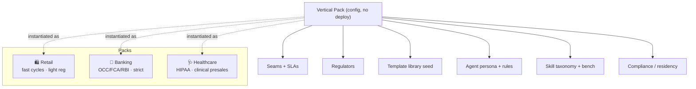
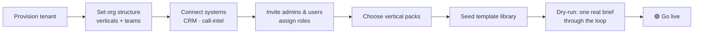
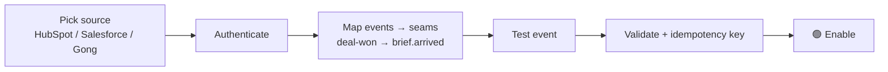
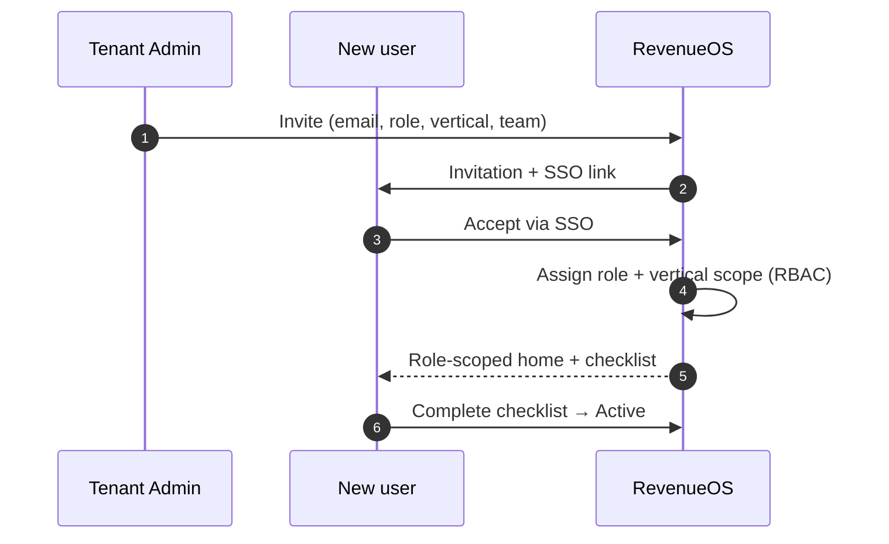
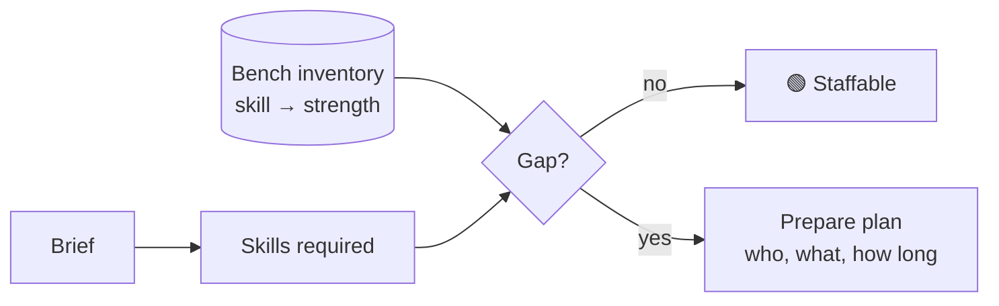
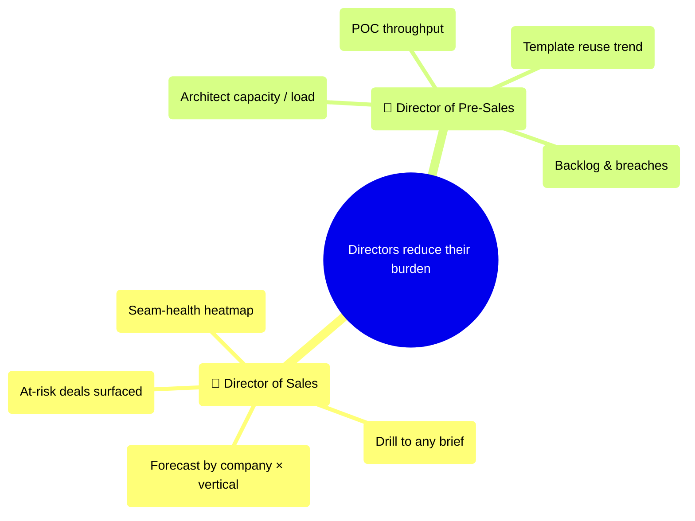
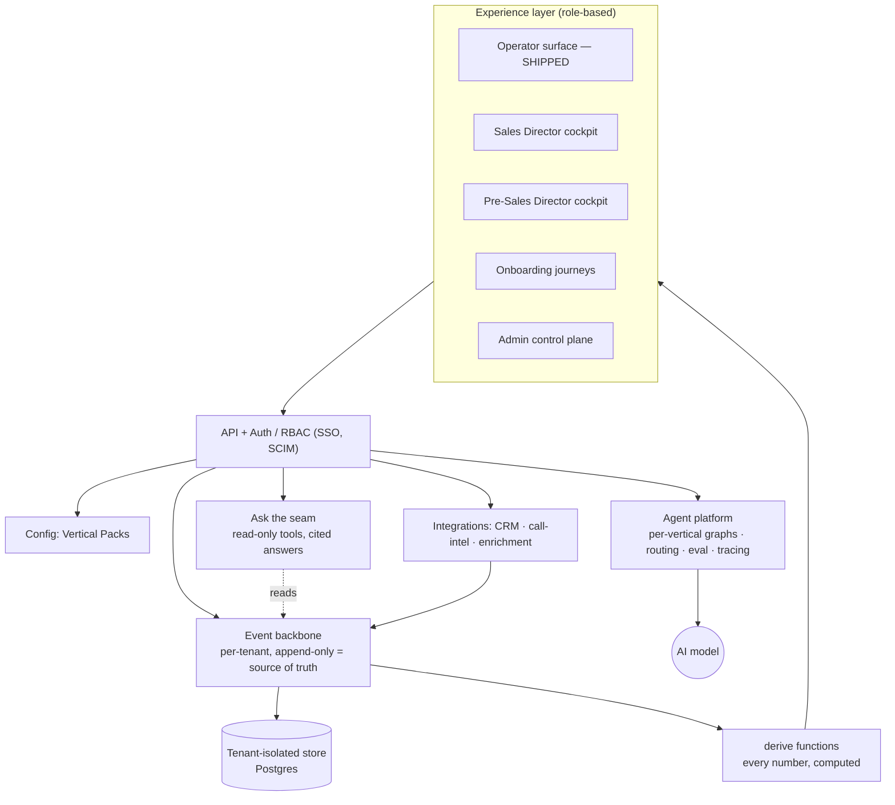

# RevenueOS — the product

One seam works today. This is what the rest of the product is, how the shipped
loop generalises into it, and what each part would cost.

> **Read this as a plan.** Sections 1 and 2 describe software that runs.
> Everything from section 3 onward is designed, ticketed and unbuilt. Where a
> section is planned it says so, and it names the epic that would build it.
>
> Milestones: [M0–M6](https://github.com/anupsahoo/revenueos/milestones) ·
> [epics](https://github.com/anupsahoo/revenueos/issues?q=is%3Aissue+is%3Aopen+label%3Aepic)
> · **45 open, 19 closed**

---

## 1. What runs today (M0 · shipped)

One screen: the Sales → PreSales operator loop, at
[revenueos-blond.vercel.app](https://revenueos-blond.vercel.app).

**The five things that make it a product rather than a demo:**

| | What it means |
|---|---|
| **The log is the only truth** | Nothing on screen is stored. Age, status, reuse, boosts, triggers and health are pure functions over an append-only event log. |
| **Every number names its query** | Each figure carries an ⓘ showing how it was derived. A number that cannot show its query does not go on the screen. |
| **Retrieval you can argue with** | Structured scoring with written reasons, threshold 40. A Solution Architect can push back on a match; nobody can push back on a similarity score. |
| **The decision is the feedback** | No rating widget. Accept and reject are the signal, worth ±8 to every template the draft used. |
| **The human holds the commitment** | The agent drafts and explains. It never presses Accept. |

Two more things are on the screen and are picked up as platform capabilities in
sections 7 and 9: **skills needed against bench strength** per brief, with a
prepare plan when there is a gap, and **"Ask the seam"** — a chat with no memory
and six read-only tools that cites its sources and refuses what the tools cannot
answer.

**Honest limits.** Synthetic data, labelled on screen. In-memory event store, so
a cold start loses every decision. Single tenant, no auth, no workers.

---

## 2. The bet

A B2B software company loses 4.8 days at one seam because prior solutions are not
retrievable at the moment a brief arrives. Fixing that seam is worth real money.
Fixing *seams* — as a category, configurable per vertical, across many companies —
is a platform.

The generalisation is narrow and specific: **every seam has the same shape.**
Something arrives, something has to be produced from prior work, a person commits
to it, and a clock runs against an SLA. The shipped loop is one instance of that
shape. Everything below is what it takes to run many instances for many
companies.

---

## 3. Who uses it — tenancy and personas *(planned)*

> [EPIC #20 · Multi-tenancy & identity](https://github.com/anupsahoo/revenueos/issues/20) —
> [#30](https://github.com/anupsahoo/revenueos/issues/30) tenant model ·
> [#31](https://github.com/anupsahoo/revenueos/issues/31) RBAC ·
> [#32](https://github.com/anupsahoo/revenueos/issues/32) SSO/SCIM ·
> [#33](https://github.com/anupsahoo/revenueos/issues/33) isolation guards

Each vertical is its **own world** — retail sales is not banking sales, and
pre-sales differs the same way. A user belongs to a company, a vertical and a
role.

| Persona | Scope | What they do | Rough count at scale |
|---|---|---|---|
| Platform Super Admin | Platform | Operates RevenueOS, onboards companies | tens |
| Tenant Admin | Company | Onboards verticals, systems, users | ~1–3 / company |
| **Director of Sales** | Company / verticals | Forecast, seam health across the portfolio | ~1 / company |
| **Director of Pre-Sales** | Company / verticals | Capacity, POC throughput, reuse | ~1 / company |
| Sales Manager / AE | Vertical | Owns opportunities, hands off briefs | thousands |
| **Solution Architect** | Vertical | Turns briefs into POC plans — **the shipped loop** | thousands |
| Delivery Lead | Vertical | Receives the handoff | hundreds |
| Support Lead | Vertical | Feeds renewal and upsell signals back | hundreds |
| Viewer / Exec stakeholder | Company | Read-only | many |

**Scale target:** 20 companies · 20k–40k users · isolated per tenant.

Only the Solution Architect has a screen today. Everyone else in this table is a
plan.

---

## 4. The event model — how the loop generalises

This is the part that decides whether the rest of the product is cheap or
expensive to build, so it comes before the screens.

Every event carries the same envelope: `id`, `ts`, `type`, `actor`, `subject`,
`payload`, `synthetic`. Adding a seam adds event *types*, not a new data model,
and it inherits every derived number for free — age, status, breach, reuse.

**What has to change to get there:** the log becomes per-tenant and durable
([#53](https://github.com/anupsahoo/revenueos/issues/53)), and seam definitions
move into vertical packs
([#39](https://github.com/anupsahoo/revenueos/issues/39)). Nothing about the
envelope changes.

[#53](https://github.com/anupsahoo/revenueos/issues/53) is the first ticket after
M0 whatever its milestone says, because everything on screen derives from the log
and the log surviving a restart is the difference between a demo and a product.

---

## 5. Verticals are configuration, not code *(planned)*

> [EPIC #22 · Vertical packs](https://github.com/anupsahoo/revenueos/issues/22) —
> [#39](https://github.com/anupsahoo/revenueos/issues/39) schema ·
> [#40](https://github.com/anupsahoo/revenueos/issues/40) / [#41](https://github.com/anupsahoo/revenueos/issues/41) / [#42](https://github.com/anupsahoo/revenueos/issues/42) packs ·
> [#43](https://github.com/anupsahoo/revenueos/issues/43) authoring

Switching a team's pack changes its seams, SLAs, templates, **agent behaviour**
and **skill taxonomy** with no code change. That is how "retail today, banking
tomorrow" works, and the acceptance test for
[#39](https://github.com/anupsahoo/revenueos/issues/39) is that the shipped loop
is itself expressible as a pack.

---

## 6. Onboarding is the product's first impression *(planned)*

> [EPIC #21 · Onboarding suite](https://github.com/anupsahoo/revenueos/issues/21)
> · [EPIC #27 · Data & integrations](https://github.com/anupsahoo/revenueos/issues/27)

**A company** — [#34](https://github.com/anupsahoo/revenueos/issues/34)

Go-live is blocked until a real brief has been through the real loop. Time from
signed to first drafted plan is the number this epic is judged on.

**A system** — [#56](https://github.com/anupsahoo/revenueos/issues/56),
[#57](https://github.com/anupsahoo/revenueos/issues/57)

**A user** — [#36](https://github.com/anupsahoo/revenueos/issues/36)

Every step's owner, state and age is derived from events and shown on a progress
map ([#38](https://github.com/anupsahoo/revenueos/issues/38)), using the same
amber and red rules as the seam. A stalled onboarding goes amber on its own.

---

## 7. Can we build it, and can we staff it

Reuse answers *have we built this before*. Skills answer *can we staff it*. A POC
date that ignores the second one is a date that slips.

The operator screen does this per brief today, against a synthetic bench. As a
platform it becomes the Director of Pre-Sales' capacity view
([#45](https://github.com/anupsahoo/revenueos/issues/45)), with the skill
taxonomy coming from the vertical pack rather than from a constant.

---

## 8. The two director cockpits *(planned)*

> [EPIC #23](https://github.com/anupsahoo/revenueos/issues/23) —
> [#44](https://github.com/anupsahoo/revenueos/issues/44) sales ·
> [#45](https://github.com/anupsahoo/revenueos/issues/45) pre-sales ·
> [#46](https://github.com/anupsahoo/revenueos/issues/46) drilldown

Sales asks *where is the risk?* Pre-Sales asks *where is the burden?* Then both
drill portfolio → company → vertical → brief.

These are the screens most likely to tempt someone into typing a number in, which
is why the rule from the shipped loop is the acceptance criterion: **no tile
ships without a derive function and an ⓘ.**

---

## 9. Platform architecture *(planned)*

Everything is tenant-scoped. Health, reuse and rankings are computed from the
per-tenant event log, never typed in — the same rule the shipped screen already
enforces.

---

## 10. Build order

Every open ticket carries acceptance criteria, the files it would touch, what it
depends on and a size. None is a placeholder. None is built.

| Milestone | What it delivers | Epics | Open | Status |
|---|---|---|---|---|
| **M0 · Prototype** | The Sales → PreSales loop on an event log | — | 0 | **complete**, 19 closed |
| **M1 · Multi-tenant foundation** | Tenancy, RBAC, SSO, isolation | [#20](https://github.com/anupsahoo/revenueos/issues/20) | 5 | planned |
| **M2 · Onboarding suite** | Company, vertical, user, project journeys + real sources | [#21](https://github.com/anupsahoo/revenueos/issues/21), [#27](https://github.com/anupsahoo/revenueos/issues/27) | 10 | planned |
| **M3 · Vertical packs** | Retail, banking, healthcare as configuration | [#22](https://github.com/anupsahoo/revenueos/issues/22) | 6 | planned |
| **M4 · Executive cockpits** | Two director cockpits + operator v2 | [#23](https://github.com/anupsahoo/revenueos/issues/23), [#24](https://github.com/anupsahoo/revenueos/issues/24) | 7 | planned |
| **M5 · Agent platform & scale** | Per-vertical agents, eval, durable store, workers | [#25](https://github.com/anupsahoo/revenueos/issues/25), [#26](https://github.com/anupsahoo/revenueos/issues/26) | 9 | planned |
| **M6 · Design system & governance** | Component library, audit, residency, posture | [#28](https://github.com/anupsahoo/revenueos/issues/28), [#29](https://github.com/anupsahoo/revenueos/issues/29) | 8 | planned |

M0 is closed out. [#13](https://github.com/anupsahoo/revenueos/issues/13) was
reopened when only a skeleton existed, and closed again once the generator was
actually built — see `lib/handoff.ts`.

**The milestone order is not the build order.** The twelve-week sequence, the
dependency graph and what I would drop if I lost four weeks are in
[`docs/ROADMAP.md`](docs/ROADMAP.md). What I deliberately left out, and what
breaks first at ten times the volume, is in
[`docs/CUT-LIST.md`](docs/CUT-LIST.md).
