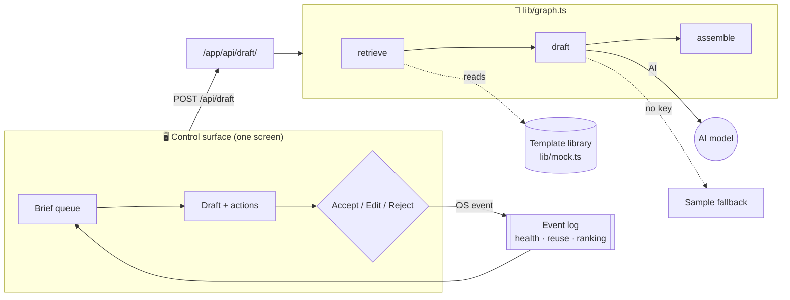
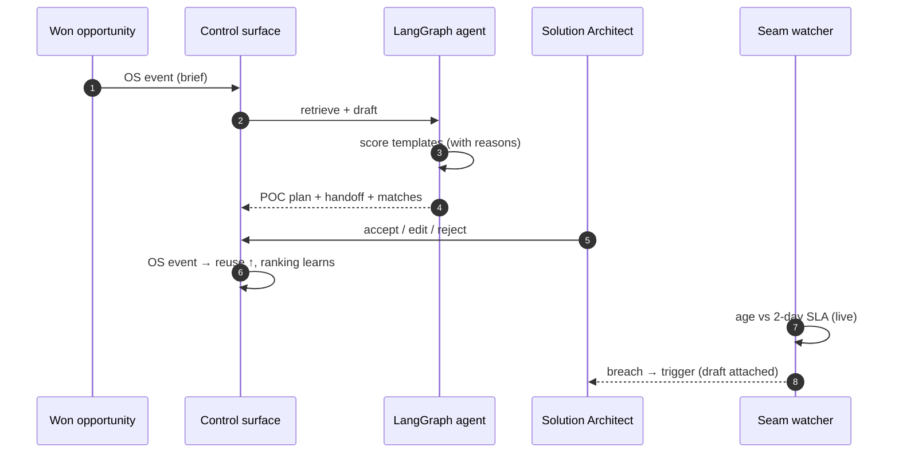
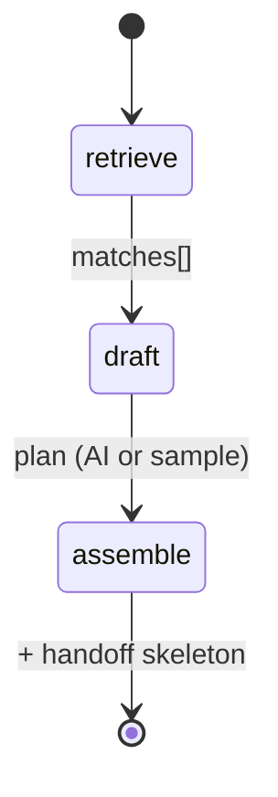

# RevenueOS — Brief→POC-Plan Loop

### ▶ Live demo: **https://revenueos-blond.vercel.app**

_Runs on Vercel with synthetic data — no login, no setup. Click a brief in the
queue, watch the agent draft an editable POC plan, accept/edit/reject it, and see
the seam tick toward its SLA and fire a breach trigger on its own._

---

An operating system for a revenue handoff. When Sales wins a deal, the
Sales→PreSales handoff (the "seam") is cleared by an AI agent, a person decides,
the system learns from that decision, and the seam watches its own SLA health.

## The loop

```
Won opportunity  ─▶  OS event (brief)  ─▶  Agent retrieves templates + drafts
   (CRM-shaped)                              POC plan & handoff skeleton
                                                     │
                                                     ▼
   Seam health  ◀──  OS events  ◀──  Solution Architect accepts / edits / rejects
   (age vs SLA,                             (decision is itself an event;
    green/amber/red,                         reuse rate + template ranking learn)
    trigger on breach)
```

## The problem it solves

A B2B platform sells to banks and insurers. Deals stall at one seam: when a
brief reaches PreSales, a solutions engineer must pick it up and start the POC
plan, but prior solution templates aren't retrievable at that moment — so every
POC is built from scratch and briefs sit idle against their SLA.

This loop makes those templates **retrievable, explainable, and reusable** at the
instant a brief arrives, and measures reuse going up.

## Principles

- **Every handoff is an event** — timestamped and owned; the event log is the source of truth.
- **Health is computed, not reported** — SLA state is derived from events, never typed in.
- **Agents do the volume work; people decide** — the agent drafts and explains; a person commits.

## Plan & tickets

The shipped code (this repo) is the **M0 prototype** — a working single-tenant
Brief→POC loop. The **enterprise product** (multi-tenant, per-vertical, exec
cockpits, onboarding journeys, 40k users) is planned as
[**10 epics + 35 stories across M1–M6**](https://github.com/anupsahoo/revenueos/milestones).

➡️ **See [`PRODUCT.md`](PRODUCT.md)** for the pictorial product plan: personas &
tenancy, company/system/user onboarding journeys, vertical packs, the
multi-tenant architecture, and the two director cockpits.

M0 issues labelled [`cut`](https://github.com/anupsahoo/revenueos/issues?q=label%3Acut)
were deliberately left out of the prototype. Each carries a one-line reason and
is cross-referenced from [`docs/CUT-LIST.md`](docs/CUT-LIST.md). Issues labelled
`duplicate` are tracked by a later milestone issue, not done. The repo has one
screen on purpose: the operator loop is the front door at `/`. The earlier
portfolio and cockpit screens were removed rather than left to look like
capability.

## Architecture, end to end (pictorial)

### High-level — request to answer



### The loop — who does what



### Low-level — the agent state machine (`lib/graph.ts`)



### Every file, and how it connects

| File | Layer | Role | Business use case | Connects to |
|---|---|---|---|---|
| `app/page.tsx` | Frontend | The one control surface: queue, draft, decisions, seam health, logs | The screen a Solution Architect works from | → `app/api/draft`, `lib/mock`, `Visuals` |
| `app/components/Visuals.tsx` | Frontend | Inline-SVG engine diagram, SLA gauge, sparkline, region bars | Makes the seam's health *visible*, not read | used by `page.tsx` |
| `app/api/draft/route.ts` | API | Runs the agent for a brief | Turns a brief into an editable plan | → `lib/graph` |
| `lib/graph.ts` | Backend (LangGraph) | State machine: retrieve → draft → assemble | The agent that does the volume work | → `lib/retrieval`, AI model, `lib/mock` |
| `lib/retrieval.ts` | Backend | Explainable scoring + learned boosts | "Reasons over knowledge" — why each template matches | reads `lib/mock` |
| `lib/mock.ts` | Data | Synthetic briefs, template library, sample plans | The seam the real event store/DB replaces | imported everywhere |
| `app/globals.css` | Frontend | Design tokens (light/dark) + components | Consistent, themeable control-room look | used by all UI |
| `app/layout.tsx` | Frontend | App shell, fonts, metadata | — | wraps `page.tsx` |
| `.github/workflows/release-deploy.yml` | Infra | Release → Vercel production deploy | Ship a version on demand | Vercel |

## Stack

- **Next.js (App Router) + TypeScript**, deployed on **Vercel** — one repo, one control surface, API routes.
- **An AI model** (tool-calling) for retrieval-explanation + drafting.
- **Append-only event store** behind one interface — in-memory + seed for demo/local (no accounts to run), swappable to **Neon / Vercel Postgres** for persistence.
- **Explainable retrieval** over a seeded library that **learns from accept/reject**.

All data in this repo is synthetic.

## Status

🟢 Live on Vercel — [revenueos-blond.vercel.app](https://revenueos-blond.vercel.app).

One screen, one loop. A brief arrives as an event, the agent retrieves matching
past solutions and drafts an editable POC plan, the Solution Architect accepts,
edits or rejects, and the seam watches its own SLA.

Nothing on the screen is typed in. Every action writes to an append-only event
log (`lib/events.ts`) and every number is worked out from that log by a small
function in `lib/derive.ts`: brief age in business days, green/amber/red status,
the queue, the reuse rate, the ranking boosts, the trigger log and the health
counts. Each number on screen carries an ⓘ that names the query behind it. The
screen re-reads the log every 30 seconds, and a brief that passes the two-day
SLA fires an escalation to the named owner with the draft attached.

The event store is in memory, so it resets when the instance sleeps. That is
stated on screen. The durable swap is one environment variable and is left as a
documented interface in `lib/events.postgres.ts` (issue #53). All data is
synthetic. Drafting falls back to a deterministic sample plan when no AI key is
set, so the demo runs with no configuration. Run `npm test` for the arithmetic.

## Deploy your own

[](https://vercel.com/new/clone?repository-url=https://github.com/anupsahoo/revenueos)

Zero-config (Next.js). Optionally add `ANTHROPIC_API_KEY` (and
`LLM_MODEL`) in project env vars to enable AI drafting.

## Run

```bash
npm install
npm run dev          # http://localhost:3000
```

Runs with no configuration — POC drafting falls back to a deterministic sample
plan. To draft with the AI model, set an API key (see [`.env.example`](.env.example)):

```bash
cp .env.example .env.local   # add ANTHROPIC_API_KEY
```

`npm run build` produces the Vercel production build.
