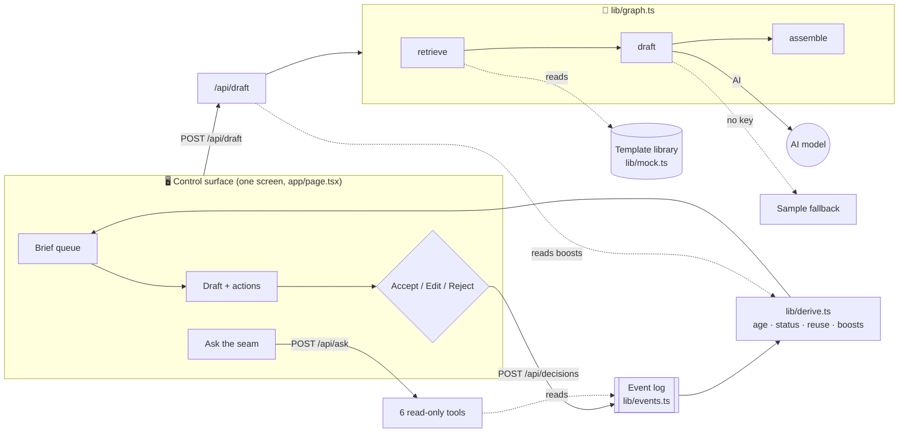
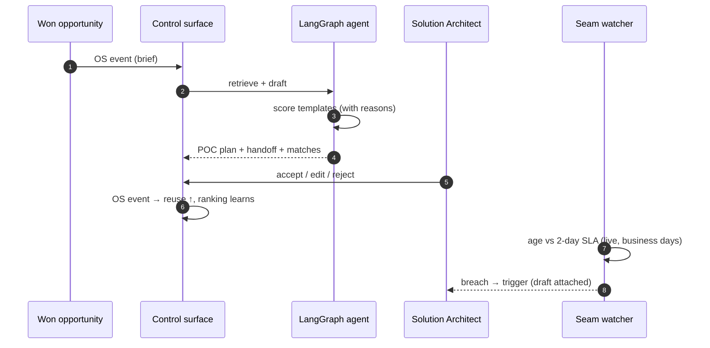
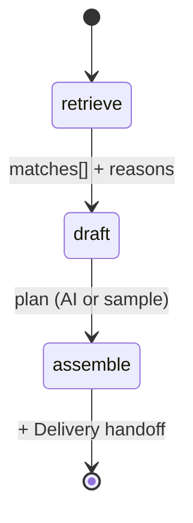

# RevenueOS — the Brief → POC-Plan loop

### ▶ Live: **https://revenueos-blond.vercel.app**

_Synthetic data, no login, no setup. Click a brief, watch the agent draft an
editable POC plan, accept or reject it, and see the seam tick toward its SLA and
escalate on its own._

Start here: **[OVERVIEW.md](OVERVIEW.md)** — what this is and what is real, in
two minutes.

---

An operating system for one revenue handoff. When Sales wins a deal, the
Sales → PreSales handoff — the **seam** — is cleared by an agent, a person
decides, the system learns from that decision, and the seam watches its own SLA.

## The problem, in four numbers

A B2B software company sells to banks and insurers. A won deal becomes a brief,
and a Solution Architect has **two business days** to pick it up and start the
POC plan.

| The SLA | US actual | US reuse of prior solutions | UK / India reuse |
|---|---|---|---|
| **2 days** | **6.8 days** | **21%** | **58% / 55%** |

It is not a headcount problem. The templates already exist in the UK and India.
Nothing fetches them at the moment a brief arrives.

Full statement: [`docs/PROBLEM.md`](docs/PROBLEM.md).

## The loop

```
Won opportunity  ─▶  OS event (brief)  ─▶  Agent retrieves templates + drafts
   (CRM-shaped)                              POC plan & Delivery handoff
                                                     │
                                                     ▼
   Seam health  ◀──  OS events  ◀──  Solution Architect accepts / edits / rejects
   (age vs SLA,                             (decision is itself an event;
    green/amber/red,                         reuse rate + template ranking learn)
    trigger on breach)
```

Everything up to the commitment is automated. The commitment stays with a named
human — see [`docs/THE-DECISION.md`](docs/THE-DECISION.md).

## What is on the one screen

Five regions, in the order you use them.

| Region | What it does |
|---|---|
| **Seam health** | Green / amber / red counts, the reuse rate, and the oldest brief. All derived, none typed in. |
| **Brief queue** | Every brief with its live age in business days and its status. Filter by account or problem. |
| **Draft** | The retrieved matches with their reasons and scores, the editable POC plan, the generated Delivery handoff, and **accept / edit / reject**. |
| **Ask the seam** | A chat with no memory and six read-only tools. It cites what it read and refuses what the tools do not hold. |
| **Trigger log** | Every SLA escalation: when, which account, which named owner, and whether the draft was attached. |

Three things on that screen that the problem statement did not ask for, and why
they are there anyway:

- **Skills needed against bench strength.** Each brief lists the skills it
  requires against a bench inventory. Reuse answers *have we built this before*;
  skills answer *can we staff it*. A POC date that ignores the second one slips.
- **A prepare plan when there is a gap.** If the bench is short on a required
  skill, the screen says who needs what, and roughly how long — rather than just
  colouring the gap red.
- **The ranking delta after a decision.** Accept or reject and the screen tells
  you what moved in the library, so the learning is visible rather than claimed.

Every button carries a **?** and every number carries an **ⓘ** that names the
query behind it. There is a **How to use** guide in the header, written for
someone who runs pre-sales and does not write software.

## Principles

- **Every handoff is an event** — timestamped and owned; the append-only log is the source of truth.
- **Health is computed, not reported** — SLA state is derived from events, never typed in.
- **Agents do the volume work; people decide** — the agent drafts and explains; a person commits.
- **Every number names its query** — each figure on screen carries an ⓘ that shows how it was derived. If a number cannot show its query, it does not go on the screen.

## What is real, and what is not

**Real.** The event log and its tests. Retrieval scoring and the written reasons
behind each match. The three-node agent. SLA breach detection and escalation to
the named owner with the draft attached. The tool-grounded chat, including its
refusals.

**Not real yet.** All data is synthetic and labelled as such on screen. The event
store is in memory, so a cold start loses every decision and resets the reuse
rate — that is what breaks first at 10×, it is
[#53](https://github.com/anupsahoo/revenueos/issues/53), and the swap interface
is already written in `lib/events.postgres.ts`. No auth, single tenant, no
background workers.

More: [`docs/STATUS.md`](docs/STATUS.md) and [`docs/CUT-LIST.md`](docs/CUT-LIST.md).

## Architecture

### High level — request to answer



### The loop — who does what



### The agent state machine (`lib/graph.ts`)



### Every file, and how it connects

| File | Layer | Role | Why it exists | Connects to |
|---|---|---|---|---|
| `app/page.tsx` | Frontend | The one control surface: seam health, queue, draft, "Ask the seam", trigger log | The screen a Solution Architect works from | → all five API routes |
| `app/globals.css` | Frontend | Purple design tokens (light/dark) + components | One consistent, themeable console | used by all UI |
| `app/layout.tsx` | Frontend | App shell, fonts, metadata | — | wraps `page.tsx` |
| `app/api/seam/health/route.ts` | API | Returns health, queue, triggers and reuse; idempotently appends `sla.amber`, `sla.breached` and `trigger.fired` | The seam watching itself | → `lib/derive`, `lib/events` |
| `app/api/draft/route.ts` | API | Runs the agent for a brief, appends `draft.generated` | Turns a brief into an editable plan | → `lib/graph`, `lib/derive` (boosts) |
| `app/api/decisions/route.ts` | API | Accept / edit / reject → `draft.*` event; returns recomputed boosts and reuse | Makes the human decision durable and consequential | → `lib/events`, `lib/derive` |
| `app/api/ask/route.ts` | API | Tool-use loop with six read-only tools; refuses what the tools cannot answer | "Ask the seam" — grounded answers, no free recall | → `lib/events`, `lib/derive`, `docs/` |
| `app/api/events/route.ts` | API | Raw read of the event log | Lets anyone check the screen against the source | → `lib/events` |
| `lib/events.ts` | Backend | The append-only log behind one interface; in-memory implementation | Single source of truth | seeded by `lib/seed` |
| `lib/derive.ts` | Backend | Pure functions over the log: business-day age, status, queue, reuse, boosts, triggers, health | Every number on screen, computed not stored | reads events only |
| `lib/handoff.ts` | Backend | Generates the Delivery handoff from the accepted plan; marks any section it cannot source as needing a person | Delivery stops retyping the same sections ([#13](https://github.com/anupsahoo/revenueos/issues/13)) | pure — takes brief, plan, matches |
| `lib/handoff.test.ts` | Test | Coverage arithmetic, the unsourceable section, and determinism | Proves it reports gaps instead of inventing them | tests `lib/handoff` |
| `lib/derive.test.ts` | Test | Five tests over the arithmetic, incl. weekends | `npm test` proves the numbers | tests `lib/derive` |
| `lib/seed.ts` | Data | Turns synthetic briefs into arrival events; already-late briefs carry breach + trigger | Gives the demo a believable starting log | → `lib/mock` |
| `lib/events.postgres.ts` | Backend | Interface stub and table shape for the durable store | The one-env-var swap, written but not built ([#53](https://github.com/anupsahoo/revenueos/issues/53)) | would replace `lib/events` |
| `lib/graph.ts` | Backend (LangGraph) | State machine: retrieve → draft → assemble | The agent that does the volume work | → `lib/retrieval`, AI model, `lib/mock` |
| `lib/retrieval.ts` | Backend | Explainable scoring + learned boosts, threshold 40 | "Reasons over knowledge" — why each template matches | reads `lib/mock` |
| `lib/mock.ts` | Data | 15 synthetic templates (UK + India), 16 briefs (US), skill inventory, sample plans | The synthetic seam a real CRM and library replace | imported widely |
| `.github/workflows/release-deploy.yml` | Infra | Release → Vercel production deploy | Ship a version on purpose, not on every push | Vercel |

## Stack

- **Next.js (App Router) + TypeScript**, deployed on **Vercel** — one repo, one control surface, API routes.
- **LangGraph** (`@langchain/langgraph`) for the three-node agent; **the Anthropic SDK** for the tool-use loop behind "Ask the seam".
- **Append-only event store behind one interface** — in-memory + seed so it runs anywhere with no accounts; swappable to Neon / Vercel Postgres for durability.
- **Explainable structured retrieval** over a seeded library that **learns from accept/reject**.
- **`node --test`** over the derive and handoff functions — ten tests, no test framework, TypeScript run directly.

All data in this repo is synthetic.

## Run

```bash
npm install
npm test             # 10 tests over the derive and handoff arithmetic
npm run dev          # http://localhost:3000
npm run build        # production build
```

Runs with no configuration. Without an API key, drafting falls back to a
deterministic sample plan and labels itself "sample draft", and "Ask the seam"
says it is inert rather than guessing. To enable both:

```bash
cp .env.example .env.local   # add ANTHROPIC_API_KEY
```

## Deploy your own

[](https://vercel.com/new/clone?repository-url=https://github.com/anupsahoo/revenueos)

Zero-config (Next.js). Optionally add `ANTHROPIC_API_KEY` and `LLM_MODEL` in
project environment variables to enable AI drafting and the grounded chat.

## Documentation

| | |
|---|---|
| What this is, in two minutes | [OVERVIEW.md](OVERVIEW.md) |
| The problem it is built against | [docs/PROBLEM.md](docs/PROBLEM.md) |
| Architecture and the original plan | [PLAN.md](PLAN.md) |
| The enterprise product plan (pictorial) | [PRODUCT.md](PRODUCT.md) |
| What is built vs. what is claimed | [docs/STATUS.md](docs/STATUS.md) |
| Decisions, and what each one cost | [docs/DECISIONS.md](docs/DECISIONS.md) |
| Twelve weeks against real issues | [docs/ROADMAP.md](docs/ROADMAP.md) |
| What I cut, and what breaks at 10× | [docs/CUT-LIST.md](docs/CUT-LIST.md) |
| How one engineer runs this with agents | [docs/IC-OPERATING-MODEL.md](docs/IC-OPERATING-MODEL.md) |
| How it was built, tools and models named | [docs/BUILD-LOG.md](docs/BUILD-LOG.md) |
| Honest build time | [docs/TIME-LOG.md](docs/TIME-LOG.md) |
| The grounded chat, in detail | [docs/ASK-THE-SEAM.md](docs/ASK-THE-SEAM.md) |
| Eight-minute demo, timed | [docs/DEMO-SCRIPT.md](docs/DEMO-SCRIPT.md) |
| Twelve questions, honest answers | [docs/QUESTIONS.md](docs/QUESTIONS.md) |
| Ten slides | [docs/slides/](docs/slides/) |

## Plan and tickets

The shipped code is the **M0 prototype** — a working single-tenant Brief → POC
loop, closed as **19 issues — M0 is complete**. The enterprise product
(multi-tenant, per-vertical, exec cockpits, onboarding journeys) is planned as
**45 open issues across [M1–M6](https://github.com/anupsahoo/revenueos/milestones)**.

Every open ticket carries acceptance criteria, the files it would touch, what it
depends on and a size. They are written to be argued with before anyone builds
them — not as titles with a sentence underneath. Ten
[epics](https://github.com/anupsahoo/revenueos/issues?q=is%3Aissue+is%3Aopen+label%3Aepic)
group them, each with its children as a checklist and a "done when" that is
testable.

See [`PRODUCT.md`](PRODUCT.md) for the pictorial product plan: personas and
tenancy, onboarding journeys, vertical packs, the multi-tenant architecture and
the two director cockpits.

M0 issues labelled [`cut`](https://github.com/anupsahoo/revenueos/issues?q=label%3Acut)
were deliberately left out; each carries a one-line reason and is cross-referenced
from [`docs/CUT-LIST.md`](docs/CUT-LIST.md). Issues labelled `duplicate` are
tracked by a later milestone issue, not done.

The repo has one screen on purpose: the operator loop is the front door at `/`.
Earlier portfolio and cockpit screens were removed rather than left to look like
capability.
