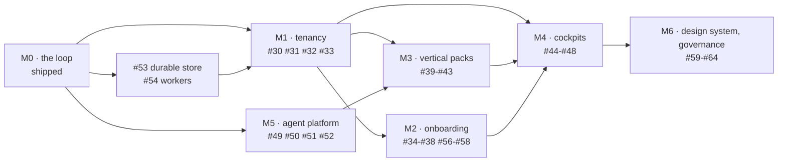

# Roadmap

Twelve weeks, one engineer, AI agents doing most of the typing. Issue numbers
below are the live ones in this repo. I have not invented tickets and I have not
renumbered anything.

> `[ANUP]` markers: **the four-week cut** (confirm you agree with what I would drop first).

## Dependencies, and one thing out of order

Two things this graph is meant to say out loud.

**M1 has to come before M3 and M4.** A vertical pack (#39) is configuration
*owned by a tenant*. A cockpit (#44, #45) shows one company's portfolio. Both
need the tenant and org model (#30) and the isolation guards (#33) underneath
them, or they get built twice.

**M5 is numbered fifth and is actually second.** #53, the durable event store,
is the first thing I would do after M0, even though it sits in M5. Everything on
the screen derives from the log, so the log surviving a restart is not a scaling
concern, it is the difference between a demo and a product. #54 (background
workers) rides along with it, because the 60-second route timeout is the next
thing that breaks. I would rather say that than pretend the milestone numbers
are a plan.

## Twelve weeks, six sprints

| Sprint | Weeks | Issues | Size | The one risk |
|---|---|---|---|---|
| S1 · Make it survive | 1-2 | #53, #54, #13 | L, M, S | Swapping the store changes read latency everywhere; if derive-on-read is too slow I need a materialised view sooner than planned. |
| S2 · Tenancy | 3-4 | #30, #31, #33 | L, M, M | Isolation bugs are silent. If #33 is weak, every later screen leaks and I find out late. |
| S3 · Sign-in and the first vertical pack | 5-6 | #32, #39, #41 | M, L, M | SSO/SCIM is the classic time sink. If it slips it pushes onboarding, not the packs. |
| S4 · Onboarding and one real source | 7-8 | #34, #35, #56, #57 | L, M, M, M | A real CRM webhook drags in retries, replays and duplicate events. The log has to be idempotent on ingest. |
| S5 · Cockpits | 9-10 | #44, #45, #46, #47 | L, L, M, M | These are the screens that tempt me to fake numbers. Every tile needs a derive function or it does not ship. |
| S6 · Quality and the rest of the packs | 11-12 | #51, #50, #40, #42 | M, M, M, M | Without #51 landing early, drafting quality across three packs is unmeasured and I am tuning blind. |

Sizes are S, M and L. The repo does not use story points and I am not going to
invent them.

## If I lost four weeks

I would drop S5 and S6 and ship S1 to S4. `[ANUP: confirm]`

Concretely: cut the cockpits (#44, #45, #46, #47) and the extra vertical packs
(#40, #42), and keep #51 by pulling it forward into S4. The loop with a durable
log, tenancy, onboarding and one real event source is a product. Cockpits on top
of it are a reporting layer I can add later, and they are the part a customer can
live without for a quarter. I would not cut #53 or #33 under any pressure. One
loses the data, the other loses the customer.

## Definition of done

Every ticket inherits this. No exceptions, including the ones an agent writes.

1. Tests for the arithmetic it introduces, in the same commit.
2. If it puts a new number on screen, that number has a derive function and an ⓘ
   naming the query. No derive function, no number.
3. Seeded data carries `synthetic: true` and the UI keeps saying so.
4. A row in `docs/TIME-LOG.md`, with retries recorded honestly.
5. The commit message says what changed and why, in plain English.
